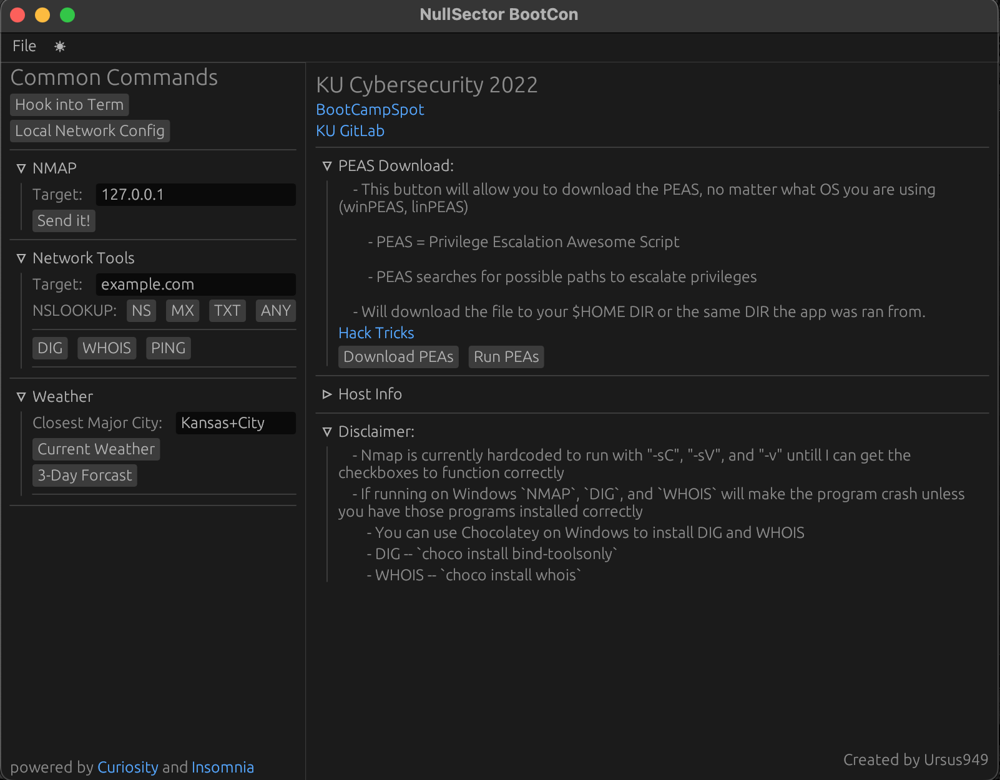

# KU-BootCon
BootCon Project:

This application was created as a finial project for a Cyber Security program. The goal of the final project was to explain a tool or application to the rest of the class, that had not already been discussed. I decided to create an application in order to apply my knowledge of Rust and get my feet wet with GUI application creations. I wanted the application to be a sort of "one stop shop" to assist someone new to the field, so I included common commands/tools I believe will be helpful.

The application has room to add many more utilities to fit your needs. It can be as simple or comlplex as you want it to be. This serves as a jumping off point for those looking to "tinker".

